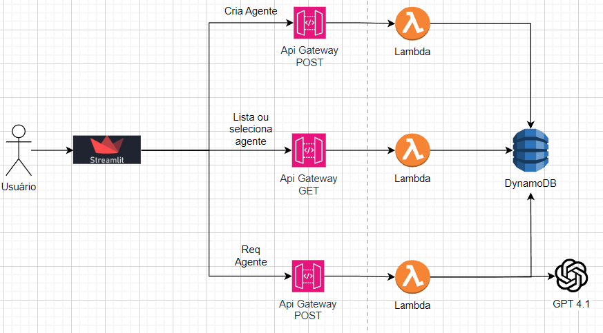

# Agent Gallery

> **Centralize, descubra e interaja com agentes de IA — tudo em um só lugar.**

Agent Gallery é uma plataforma para registrar, catalogar e conversar com agentes de IA customizados. Construída sobre infraestrutura serverless na AWS e alimentada pelo GPT-4 da OpenAI, oferece uma interface Streamlit intuitiva para que times possam gerenciar seus agentes e interagir com eles diretamente — sem escrever uma linha de código.

---

## Por que o Agent Gallery existe?

Times que constroem com IA frequentemente acabam com dezenas de agentes espalhados por ferramentas, documentos e scripts. O Agent Gallery resolve isso:

- **Descoberta** — encontre o agente certo para o trabalho a partir de um catálogo central
- **Reuso** — compartilhe agentes entre times para evitar retrabalho
- **Interatividade** — converse com qualquer agente cadastrado direto pela interface
- **Governança** — prompts e metadados armazenados e consultáveis no DynamoDB
- **Escalabilidade** — 100% serverless; escala para zero quando ocioso, sobe sob demanda

---

## Arquitetura


Toda a infraestrutura é provisionada com **Terraform**, organizada em módulos independentes.

---

## Funcionalidades

| Funcionalidade | Descrição |
|----------------|-----------|
| Galeria de Agentes | Navegue por todos os agentes cadastrados em um catálogo visual |
| Cadastrar Agente | Adicione um novo agente com nome, descrição e prompt de sistema |
| Chat | Envie mensagens para qualquer agente e receba respostas via GPT-4.1 |
| Detalhe do Agente | Inspecione metadados e o prompt de um agente específico |
| Backend Serverless | AWS Lambda + API Gateway + DynamoDB |
| Gerenciamento de Segredos | Chaves armazenadas com segurança no AWS SSM Parameter Store |

---

## Estrutura do Projeto

```
agent-gallery/
├── app.py                  # Entrypoint Streamlit — página principal da galeria
├── pages/                  # Páginas adicionais (cadastro, chat, detalhe)
├── utils/
│   ├── styles.py           # Estilização CSS customizada
│   ├── menu.py             # Navegação lateral
│   ├── logo.py             # Componente de logo
│   └── interface.py        # Componente de listagem de agentes
├── infra/                  # Infraestrutura como código (Terraform)
│   ├── apigtw/             # Módulo: API Gateway (rotas e integrações)
│   ├── dynamodb/           # Módulo: tabela DynamoDB de agentes
│   ├── lambda/             # Módulo: funções Lambda (get, post, chat)
│   └── ssm/                # Módulo: parâmetros e segredos no SSM
├── main.tf                 # Raiz do Terraform — orquestra os módulos
├── variables.tf            # Variáveis de entrada do Terraform
├── requirements.txt        # Dependências Python
├── doc/                    # Diagramas e assets de documentação
└── img/                    # Imagens e ícones da interface
```

---

## Como rodar

### Pré-requisitos

- Python 3.10+
- Terraform 1.4+
- AWS CLI configurado (`aws configure`)
- Chave de API da OpenAI

### 1. Clone o repositório e instale as dependências

```bash
git clone https://github.com/seu-usuario/agent-gallery.git
cd agent-gallery
pip install -r requirements.txt
```

### 2. Configure as variáveis de ambiente

```bash
cp env/.env.example .env
```

Preencha o `.env` com a URL da API após o deploy:

```env
API_BASE_URL=https://<api-id>.execute-api.<region>.amazonaws.com/prod
```

### 3. Provisione a infraestrutura

```bash
terraform init
terraform apply
```

O Terraform irá criar:
- Tabela DynamoDB para armazenar os agentes
- Três funções Lambda (GET, POST, chat)
- API Gateway com as rotas configuradas
- Parâmetros no SSM (nome da tabela, chave OpenAI)

### 4. Rode a aplicação

```bash
streamlit run app.py
```

---

## 🔌 Referência da API

| Método | Endpoint | Descrição |
|--------|----------|-----------|
| `GET` | `/agents` | Lista todos os agentes |
| `GET` | `/agents?agent_id=<id>` | Retorna um agente específico |
| `GET` | `/agents?agent_id=<id>&prompt=True` | Retorna apenas o prompt do agente |
| `POST` | `/agents` | Cadastra um novo agente |
| `POST` | `/chat` | Envia uma mensagem para um agente |

### POST /agents — Payload

```json
{
  "agent_id": "id-unico",
  "name": "Agente de Suporte",
  "description": "Responde dúvidas de clientes",
  "prompt": "Você é um assistente de suporte ao cliente..."
}
```

### POST /chat — Payload

```json
{
  "agent_id": "id-unico",
  "message": "Como faço para redefinir minha senha?"
}
```

---

## Segurança

- Todos os segredos (chave OpenAI, nome da tabela DynamoDB) são armazenados no **AWS SSM Parameter Store** com criptografia
- As roles IAM seguem o princípio do menor privilégio
- O API Gateway pode ser protegido com API Key ou autorizador Cognito (não habilitado por padrão)

---
